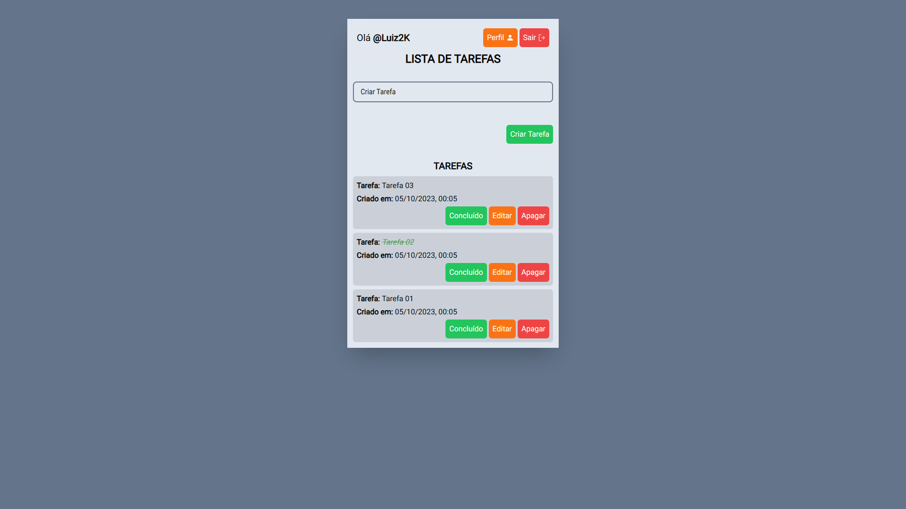

# Lista de Tarefas

### [Visitar Projeto](https://listadetarefas-luiz2k.vercel.app/)
Acesse também o repositório do [Back-end](https://github.com/luiz2k/lista-de-tarefas__API)

---

## 📝 Sobre
Meu primeiro projeto full stack, onde eu refaço um dos meus primeiros projetos, [Lista de Tarefas](https://listadetarefasv1-luiz2k.vercel.app/). A ideia desse projeto é manter todas as anotações do usuário em um banco de dados, evitando assim possíveis perda das anotações. Nesse projeto criado um sistema de login e registro, onde cada usuário poderá gerenciar suas próprias anotações. O usuário quando logado poderá acessar o seu perfil e alterar todos os seus dados, ou até mesmo excluir a sua conta.

### Funcionalidades
- **Registro e Login:** Foi desenvolvido um sistema de registro e login, possibilitando assim cada usuário ter suas própias anotações.
- **Válidação dos Formulários:** Para a válidação dos formulários da aplicação, foi utilizado o React Hook Form e Zod. 
- **Fluxo de Autenticação:** Sempre que o usuário acessar a sua conta, um token de autenticação é adicionado ao localStorage, e a válidade desse token é verificado através de um fluxo de autenticação criado com a ContextAPI, se o token de acesso for inválido, ele tenta usar o refreshToken para obter um novo token de acesso.
- **Gerenciamento Tarefas:** O usuário pode criar uma tarefa, e quando essa tarefa for concluída ele pode adicionar como concluído. O usuário também pode editar ou remover uma tarefa.
- **Página de Perfil:** Foi criado uma página de perfil onde o usuário pode alterar sua informações, ou até mesmo excluir a sua conta.

### Tecnologias
- HTML / CSS / TypeScript
- Next.JS
- Tailwind CSS
- Prettier / ESLint
- React Hook Form / Zod

---

Projeto pessoal desenvolvido por **Luiz Teles**
